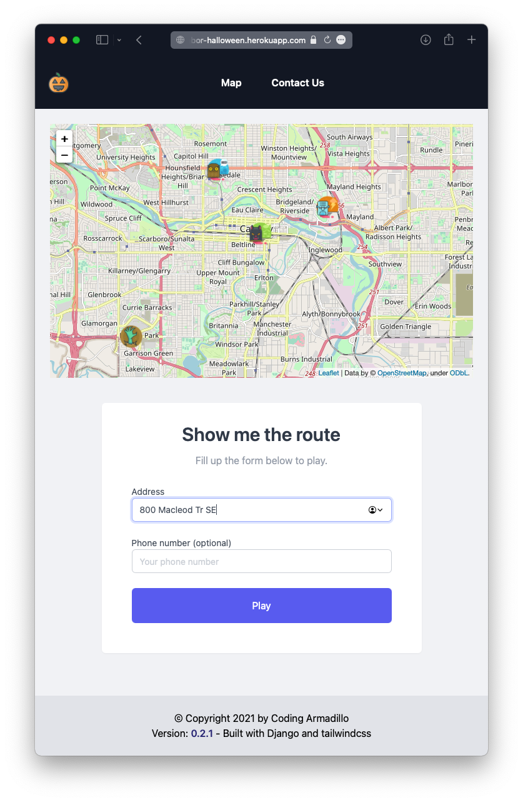
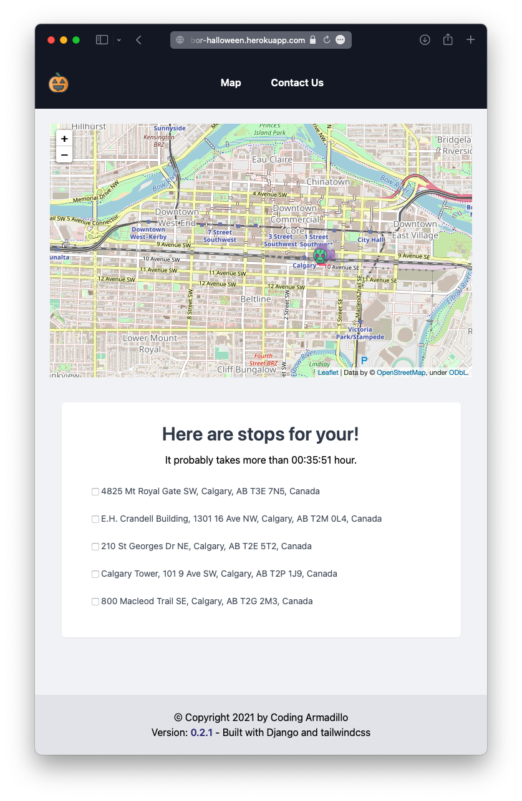
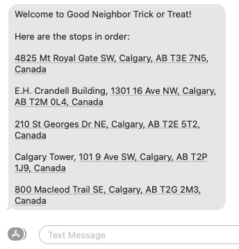

<div align="center">
    
</div>

# good-neighbor-halloween


A Django app for Halloween route

## Demo

> The demo app is turned off now. Check again next year. 😃

- It asks for your address to play.

  

- It generates an optimized route based on the given address.

  

- It sends a text notification if a phone number is provided.

  

## Getting Started

### Install

```zsh
python -m venv .venv
source .venv/bin/activate
pip install -r requirements.txt
```

Use `pip install -r requirements-dev.txt` for development. It will install `pylint` and `black` to enable linting and auto-formatting.

### Setup

Create a `.env` file to configure the [AWS SNS](https://boto3.amazonaws.com/v1/documentation/api/latest/reference/services/sns.html#sns), [GCP Geocoding API](https://developers.google.com/maps/documentation/geocoding/start), [MapQuest Optimized Route API](https://developer.mapquest.com/documentation/directions-api/optimized-route/get/), and latitude/longitude for the map.

```zsh
touch .env
```

And put down the the following information

```
GCP_KEY=...
MAPQUEST_KEY=...
MAP_LAT=...
MAP_LNG=...
AWS_ACCESS_KEY_ID=...
AWS_SECRET_ACCESS_KEY=...
AWS_REGION_NAME=...
```

For deployment to Heroku, use the following commands to set the environment variables of the app.

```zsh
heroku config:set GCP_KEY=...
heroku config:set MAPQUEST_KEY=...
heroku config:set MAP_LAT=...
heroku config:set MAP_LNG=...
heroku config:set AWS_ACCESS_KEY_ID=...
heroku config:set AWS_SECRET_ACCESS_KEY=...
heroku config:set AWS_REGION_NAME=...
```

## Credits

- [Logo][1] by [Alpár-Etele Méder][2]
- [Halloween Freebie icon set][3] by [roundicons.com][4]

[1]: https://www.iconfinder.com/icons/1531889/halloween_lamp_pumpkin_icon
[2]: https://www.iconfinder.com/pocike
[3]: https://www.iconfinder.com/iconsets/halloween-freebie
[4]: https://www.iconfinder.com/roundicons
